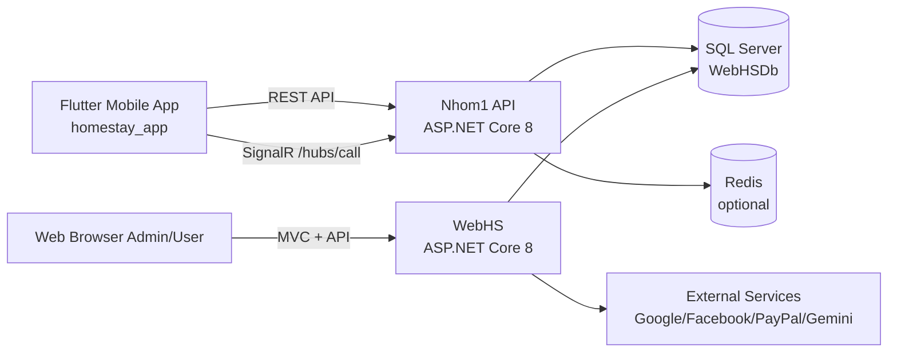

<div align="center">

# HOMESTAY PLATFORM

Multi-platform homestay booking system: Flutter Mobile + .NET API + Web Admin.

[](homestay_app)
[](homestay_app)
[](Nhom1)
[](Nhom1)
[](Nhom1)
[](README.md)

</div>

---

## Table of Contents

1. [Overview](#overview)
2. [Key Deliverables](#key-deliverables)
3. [System Architecture](#system-architecture)
4. [Project Structure](#project-structure)
5. [Core Features](#core-features)
6. [Real Project Screenshots](#real-project-screenshots)
7. [Requirements](#requirements)
8. [Quick Start](#quick-start)
9. [Run Locally](#run-locally)
10. [Flutter Configuration](#flutter-configuration)
11. [API and Realtime](#api-and-realtime)
12. [Database and Migration](#database-and-migration)
13. [Docker (WebHS)](#docker-webhs)
14. [Security and Secrets](#security-and-secrets)
15. [Troubleshooting](#troubleshooting)
16. [Roadmap](#roadmap)
17. [Related Documentation](#related-documentation)

---

## Overview

This repository contains a full homestay booking platform with three main parts:

- `homestay_app`: Flutter mobile app for guests, hosts, and admins.
- `Nhom1`: .NET 8 API backend for the mobile app, including JWT, Swagger, SignalR, and Redis fallback.
- `WebHS`: ASP.NET Core web/admin backend with external auth and business services.

The platform supports the complete booking lifecycle:

- registration and login
- role-based access control
- homestay search and discovery
- booking and payment flow
- review and feedback handling
- notifications, chat, AI assistance, and realtime calling

---

## Key Deliverables

This section explains what has been completed and how it was built.

| Highlight | What was delivered | How it was implemented |
|---|---|---|
| Full-stack architecture | Flutter mobile app, mobile API, and web/admin backend working as a complete ecosystem | Clear separation of UI, API, and operations with dedicated entry points in `homestay_app/lib/main.dart`, `Nhom1/Program.cs`, and `WebHS/Program.cs` |
| End-to-end booking flow | Search, booking, payment, review, and booking management are covered by the product flow | Module-based API design with endpoints such as `/api/homestays`, `/api/bookings`, `/api/payments`, and `/api/reviews` |
| Role-based access | Different experiences for User, Host, and Admin on both UI and backend | Backend authorization and separate role-driven routes/screens in Flutter |
| Realtime communication | Realtime call and signaling pipeline is available | SignalR hub at `/hubs/call` with Offer/Answer/ICE flow integrated in the app |
| API observability | Developers can test endpoints quickly and safely | Swagger/OpenAPI with JWT Bearer auth plus clean service-layer separation |
| Resilient caching | Dev environments still work when Redis is unavailable | Best-effort Redis with fallback to in-memory distributed cache and DataProtection defaults |
| Extensible web/admin side | WebHS supports external auth, hosted jobs, geocoding, notifications, and payment-related services | Dependency injection, service registration, and Docker Compose support |
| Business documentation | Business requirements are documented for BA, Dev, QA, and UAT | Full functional specification in `docs/BUSINESS_FUNCTIONAL_SPEC.md` |

### What can be demoed immediately

1. Register and log in as a guest, host, or admin.
2. Search homestays, create bookings, and track booking status.
3. Open Swagger to verify endpoints and JWT authentication.
4. Trigger realtime communication through the `/hubs/call` hub.

### How the team delivered it

1. The platform was split by business module: auth, homestay, booking, payment, review, notification, chat.
2. Responsibilities were separated by runtime: mobile app, API backend, and web/admin backend.
3. Configuration was standardized through `.env`, `appsettings`, launch profiles, and Docker Compose.
4. Documentation and business logic were formalized to support testing and maintenance.

---

## Real Project Screenshots

The following screenshots were selected from the report to show the most important parts of the project.

### 1) Business analysis and process design


Description: Booking use-case diagram showing the booking request, room checking, deposit processing, and approval flow.


Description: Swimlane diagram showing how the customer, system, and host/staff interact during the booking process.

### 2) Authentication screens


Description: Login screen with email/password, Google sign-in, and biometric sign-in.


Description: Registration screen with account creation, role selection, and password confirmation.

### 3) Discovery and booking screens


Description: Home screen with homestay discovery, search, and recommendations.


Description: Booking management screen showing booking statuses and post-stay actions.

### 4) Role-based management screens


Description: Host dashboard with homestay overview, bookings, revenue, and quick actions.


Description: Admin dashboard for managing users, homestays, promotions, bookings, and statistics.

### 5) Advanced features


Description: Security settings for biometric login and two-factor authentication.


Description: Gemini AI assistant for homestay search, booking support, and quick Q&A.


Description: Messaging list for guest-host communication with conversation tracking.


Description: In-app homestay/travel video content for richer discovery.

---

## System Architecture



Current architecture notes:

- `Nhom1` is the main backend for the Flutter app.
- `WebHS` handles web/admin workflows and web-oriented integrations.
- Both backends share the same `WebHSDb` database.

---

## Project Structure

```text
HOMESTAY/
|- homestay_app/     # Flutter mobile app
|- Nhom1/            # ASP.NET Core API for mobile
|- WebHS/            # ASP.NET Core MVC + web/admin
`- README.md         # this file
```

Important entry points:

- Flutter app bootstrap: `homestay_app/lib/main.dart`
- Flutter routing: `homestay_app/lib/routes.dart`
- Flutter API config: `homestay_app/lib/config/api_config.dart`
- Nhom1 bootstrap: `Nhom1/Program.cs`
- WebHS bootstrap: `WebHS/Program.cs`

---

## Core Features

### Flutter Mobile App

- Authentication: login, register, social login, OTP, biometric security
- Role-based UI: User, Host, Admin
- Homestay discovery: listing, search, detail, amenities, map
- Booking: create booking, track status, history
- Payment: deposit and payment flow
- Realtime call/chat: SignalR + WebRTC
- AI and utilities: Gemini assistant, translation, TTS/STT, YouTube, weather

### Nhom1 API (.NET 8)

- JWT authentication and authorization
- Swagger for endpoint testing
- SignalR hub for realtime calling (`/hubs/call`)
- Redis cache with DataProtection fallback
- Clear service layer for Auth, Homestay, Booking, Payment, Review

### WebHS (.NET 8 MVC)

- MVC views and admin workflows
- External authentication via Google and Facebook
- Hosted background services
- Geocoding, SEO, notifications, and payment-related integrations
- Docker Compose support

---

## Requirements

Installed tools:

- Flutter SDK 3.x
- Dart SDK 3.x
- .NET SDK 8.0+
- SQL Server local or remote
- Redis recommended for development
- Android Studio or Xcode for mobile builds

Quick checks:

```bash
flutter --version
dart --version
dotnet --version
```

---

## Quick Start

### 1) Restore dependencies

```bash
# Flutter app
cd homestay_app
flutter pub get

# Nhom1 API
cd ../Nhom1
dotnet restore

# WebHS
cd ../WebHS
dotnet restore
```

### 2) Create the Flutter environment file

```bash
cd ../homestay_app
copy .env.example .env
```

Then update `.env` with the actual values for your environment.

---

## Run Locally

Open three terminals if possible.

### A. Run Nhom1 API

```bash
cd Nhom1
dotnet run
```

Default development ports:

- HTTP: `http://localhost:5189`
- HTTPS: `https://localhost:7097`

Swagger:

- `https://localhost:7097/swagger`

### B. Run WebHS

```bash
cd WebHS
dotnet run
```

Default development ports:

- HTTP: `http://localhost:5000`
- HTTPS: `https://localhost:7264`

### C. Run Flutter

```bash
cd homestay_app
flutter run
```

If you are using an Android emulator, prefer `10.0.2.2` instead of `localhost` for the API base URL.

---

## Flutter Configuration

Main config file: `homestay_app/lib/config/api_config.dart`

Base URL logic:

- Read `API_BASE_URL` from `.env`
- Fallback to `http://10.0.2.2:5189` if missing

Example `.env` values:

```env
API_BASE_URL=http://10.0.2.2:5189
GOOGLE_MAPS_API_KEY=YOUR_KEY
GEMINI_API_KEY=YOUR_KEY
```

When testing on a real device through a tunnel/public URL:

- Update `API_BASE_URL`
- Restart the app so the environment change is loaded

---

## API and Realtime

### Core API endpoints

- Auth: `/api/auth/*`
- Homestays: `/api/homestays`
- Bookings: `/api/bookings`
- Reviews: `/api/reviews`
- Payments: `/api/payments`

### Realtime

- Call hub route: `/hubs/call`
- Flutter service: `homestay_app/lib/services/call_service.dart`
- Backend hub mapping: `Nhom1/Program.cs`

---

## Database and Migration

The current connection string points to the local SQL Server database `WebHSDb`.

Check the following files:

- `Nhom1/appsettings.json`
- `WebHS/appsettings.json`

Sample EF Core update command:

```bash
cd Nhom1
dotnet ef database update
```

Recommended practice:

- Use a separate database per environment: Dev, Staging, and Prod
- Avoid sharing production data with local testing

---

## Docker (WebHS)

`WebHS` includes a `docker-compose.yml` file.

Run it with:

```bash
cd WebHS
docker compose up --build
```

Default mappings:

- App: `8080` and `8443`
- SQL Server container: `1433`

---

## Security and Secrets

The repository currently contains several keys and secrets in configuration files. These should be rotated before any public release or production deployment.

Checklist:

1. Rotate all API keys, OAuth secrets, SMTP passwords, and PayPal credentials.
2. Move secrets to User Secrets, environment variables, or a secret manager.
3. Do not commit a real `.env` file.
4. Separate `appsettings.Development.json` from `appsettings.Production.json`.
5. Enforce HTTPS and a production CORS whitelist.

---

## Troubleshooting

### Flutter cannot call the API

- Check `API_BASE_URL` in `.env`
- On Android emulator, use `10.0.2.2` instead of `localhost`
- Make sure the backend is running on the expected port

### SignalR does not connect

- Confirm the backend maps `/hubs/call`
- Ensure the JWT token is valid
- Verify that the base URL uses the correct HTTP/HTTPS protocol

### SQL connection issues

- Check the SQL Server instance `localhost\\MSSQLSERVER01`
- Verify login permissions and certificate settings

### Redis is unavailable

- `Nhom1` falls back to in-memory cache, so the app can still run in development

---

## Roadmap

- Standardize API gateway and authentication between `Nhom1` and `WebHS`
- Add a single bootstrap command for the monorepo
- Add automated tests:
  - Flutter widget/integration tests
  - API integration tests
  - Security scanning (SAST and secret scanning)
- Add CI/CD pipelines for build, test, lint, and environment-based deployment

---

## Related Documentation

- Detailed mobile README: `homestay_app/README.md`
- TURN notes: `Nhom1/docs/turn.md`
- Host role analysis: `WebHS/Documentation/IsHost_vs_Role_Analysis.md`
- Full business specification: `docs/BUSINESS_FUNCTIONAL_SPEC.md`

---

## Contact and Contribution

If you want to expand the documentation, the next useful additions would be:

- API contract per module
- Sequence diagrams for booking, payment, and refund
- Production incident runbook

Suggested commit message style:

- `docs: update architecture`
- `docs: add deployment guide`
- `docs: security hardening checklist`

