<div align="center">

# HOMESTAY PLATFORM

He thong dat phong Homestay da nen tang: Flutter Mobile + .NET API + Web Admin

[](homestay_app)
[](homestay_app)
[](Nhom1)
[](Nhom1)
[](Nhom1)
[](README.md)

</div>

---

## Muc luc

1. [Tong quan](#tong-quan)
2. [Diem noi bat da hoan thanh](#diem-noi-bat-da-hoan-thanh)
3. [Kien truc he thong](#kien-truc-he-thong)
4. [Cau truc thu muc](#cau-truc-thu-muc)
5. [Tinh nang chinh](#tinh-nang-chinh)
6. [Hinh anh thuc te du an](#hinh-anh-thuc-te-du-an)
7. [Yeu cau moi truong](#yeu-cau-moi-truong)
8. [Cai dat nhanh](#cai-dat-nhanh)
9. [Chay du an local](#chay-du-an-local)
10. [Cau hinh cho Flutter](#cau-hinh-cho-flutter)
11. [API va Realtime](#api-va-realtime)
12. [Database va Migration](#database-va-migration)
13. [Docker (WebHS)](#docker-webhs)
14. [Bao mat va secrets](#bao-mat-va-secrets)
15. [Troubleshooting](#troubleshooting)
16. [Roadmap de xuat](#roadmap-de-xuat)
17. [Tai lieu lien quan](#tai-lieu-lien-quan)

---

## Tong quan

Day la monorepo gom 3 khoi chinh:

- `homestay_app`: ung dung Flutter cho nguoi dung/host/admin.
- `Nhom1`: backend API phuc vu mobile app, co JWT, Swagger, SignalR, Redis cache fallback.
- `WebHS`: backend MVC/web admin + external auth + cac dich vu business nang cao.

He thong huong toi quy trinh dat phong full flow:

- Dang ky/dang nhap + phan quyen role
- Tim kiem homestay + booking + thanh toan
- Danh gia, thong bao, chat va AI support
- Quan tri noi dung, nguoi dung, khuyen mai

---

## Diem noi bat da hoan thanh

Bang duoi day tra loi truc tiep 3 cau hoi: noi bat gi, da lam duoc gi, va lam the nao de dat duoc.

| Hang muc noi bat | Da lam duoc gi | Lam the nao |
|---|---|---|
| Kien truc da nen tang | Hoan thien mo hinh Flutter Mobile + Nhom1 API + WebHS, cho phep van hanh dong thoi app mobile va web/admin | Tach ro layer giao dien, API va van hanh; chuan hoa entrypoint va bootstrap tai `homestay_app/lib/main.dart`, `Nhom1/Program.cs`, `WebHS/Program.cs` |
| Full flow dat phong | Da bao phu duoc chuoi nghiep vu tu tim kiem -> booking -> thanh toan -> danh gia | Thiet ke endpoint theo module (`/api/homestays`, `/api/bookings`, `/api/payments`, `/api/reviews`) va dong bo voi man hinh Flutter |
| Phan quyen theo vai tro | Da phan vai User/Host/Admin o ca UI va backend | Kiem soat role trong API authentication/authorization va route tach rieng cho host/admin trong Flutter |
| Realtime call/chat | Da trien khai kenh goi realtime voi SignalR + WebRTC signaling | Map hub route `/hubs/call`, khoi tao ket noi tu app va dong bo luong Offer/Answer/ICE |
| Van hanh API cho mobile | Da mo Swagger de test nhanh, xac thuc JWT, va cach ly service layer | Su dung .NET middleware pipeline, auth scheme Bearer, va service-based architecture trong Nhom1 |
| On dinh cache va key management | Da co fallback khi Redis khong san sang de tranh dung he thong trong moi truong dev | Cau hinh best-effort Redis, neu that bai thi chuyen sang in-memory cache va DataProtection mac dinh |
| Web/admin co kha nang mo rong | Da co external auth, hosted background jobs, geocoding, payment integration tren WebHS | Dang ky service qua DI, tach module theo controller/service, va bo tri docker-compose cho deploy nhanh |
| Tai lieu hoa nghiep vu | Da co tai lieu BFS day du cho BA/Dev/QA/UAT | Xay dung bo Business Rules, Acceptance Criteria, UAT scenarios tai `docs/BUSINESS_FUNCTIONAL_SPEC.md` |

### Ket qua thuc te co the demo ngay

1. Dang nhap va phan quyen user/host/admin tren app.
2. Tim kiem homestay, tao booking, theo doi trang thai booking.
3. Goi API qua Swagger de verify endpoint va auth.
4. Kich hoat goi realtime thong qua hub `/hubs/call`.

### Cach team da trien khai

1. Chia theo module nghiep vu: auth, homestay, booking, payment, review, notification.
2. Chia theo vai tro van hanh: mobile app, mobile API backend, web/admin backend.
3. Chuan hoa config va moi truong (env, appsettings, launch profiles, docker compose).
4. Dat nen tang test/bao tri bang tai lieu hoa va checklist van hanh.

---

## Hinh anh thuc te du an

Bo anh duoi day da duoc chon loc tu bao cao de the hien dung cac phan can thiet nhat cua du an.

### 1) Phan tich nghiep vu va quy trinh

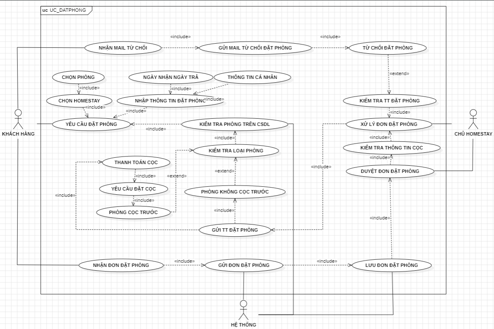

Noi dung: So do use case dat phong, mo ta tu khach hang yeu cau dat phong, kiem tra phong, xu ly coc, den duyet don.

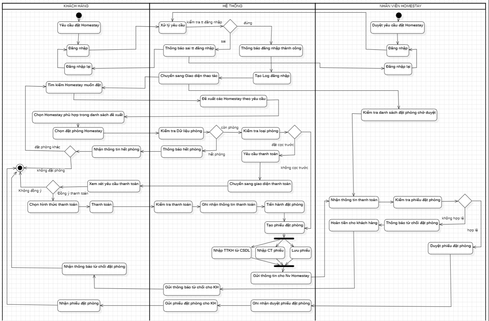

Noi dung: So do swimlane dat phong, the hien luong xu ly giua Khach hang, He thong va Nhan vien/Host.

### 2) Giao dien xac thuc tai khoan

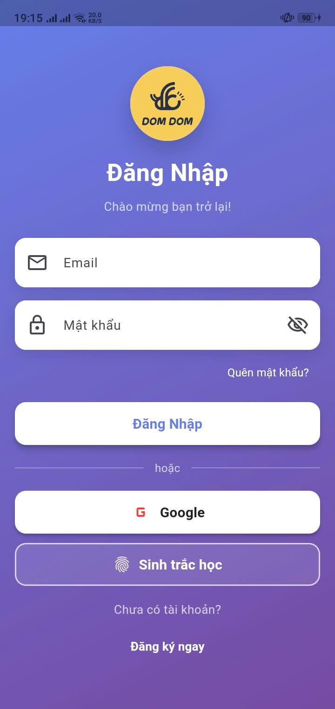

Noi dung: Dang nhap email/mat khau, Google Sign-In va sinh trac hoc.

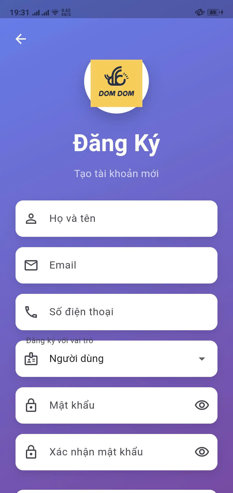

Noi dung: Dang ky tai khoan moi, chon vai tro su dung va xac nhan mat khau.

### 3) Giao dien kham pha va dat phong

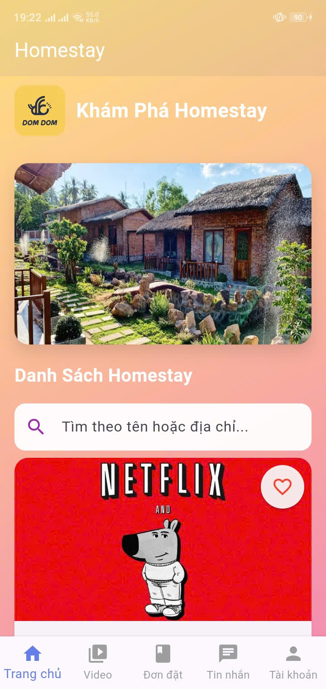

Noi dung: Trang chu kham pha homestay, tim kiem va danh sach de xuat.

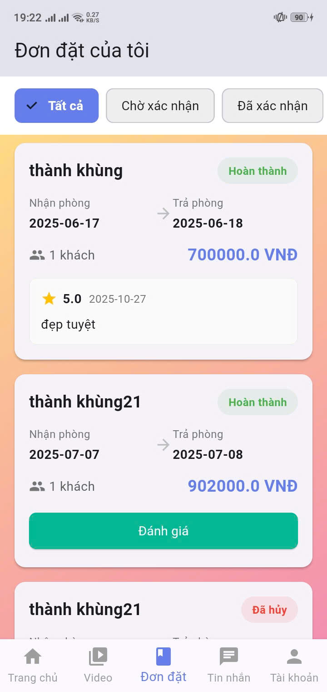

Noi dung: Quan ly don dat phong theo trang thai va thao tac danh gia sau luu tru.

### 4) Giao dien quan ly theo vai tro

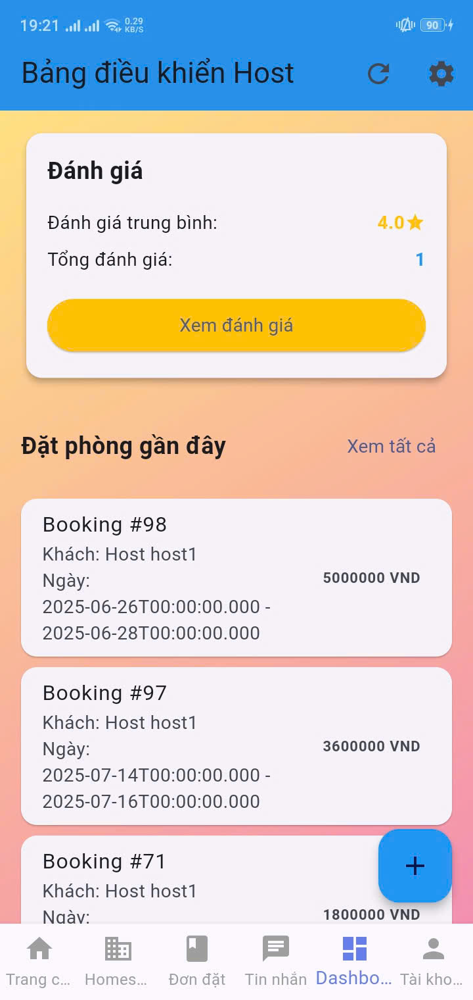

Noi dung: Dashboard Host voi tong quan homestay, don dat phong, doanh thu va hanh dong nhanh.

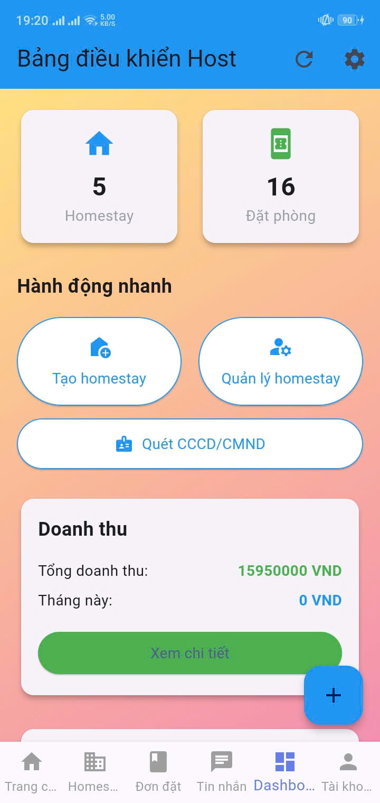

Noi dung: Dashboard Admin quan ly nguoi dung, homestay, khuyen mai, don dat phong va thong ke.

### 5) Tinh nang nang cao

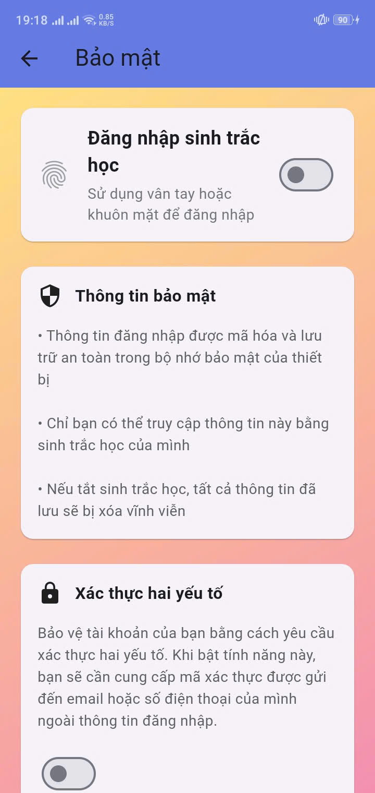

Noi dung: Cai dat bao mat tai khoan, bat/tat sinh trac hoc va xac thuc hai yeu to.

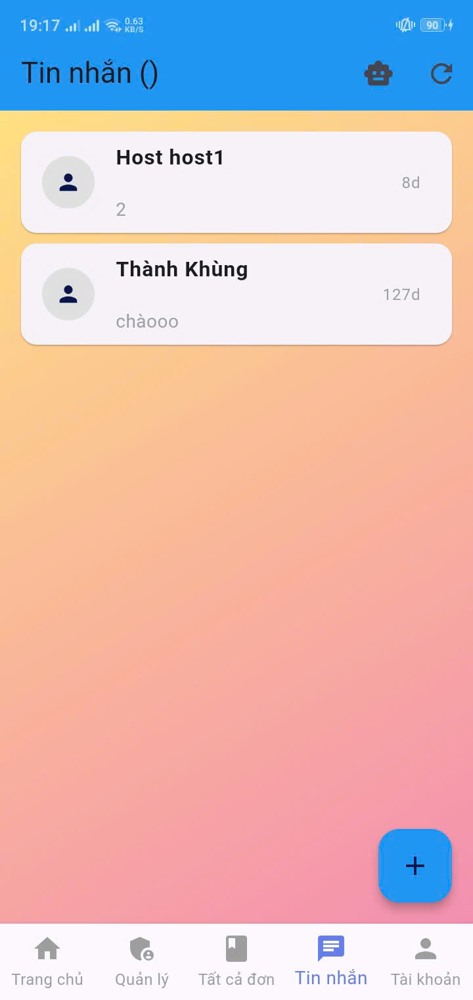

Noi dung: Tro ly AI Gemini ho tro tim homestay, tu van dat phong va giai dap nhanh.

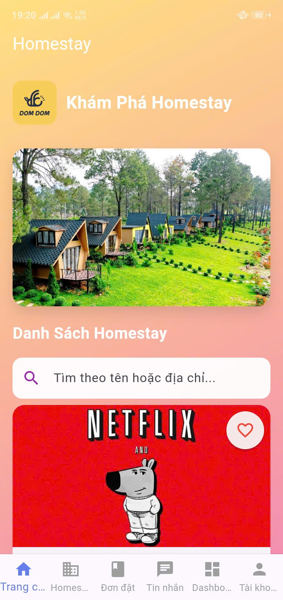

Noi dung: Nhan tin giua khach va host, theo doi hoi thoai va trang thai tin nhan.


Noi dung: Tich hop video gioi thieu diem den/homestay trong ung dung.

---

## Kien truc he thong

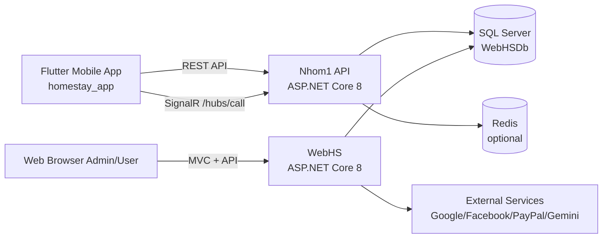

Nguyen tac thuc te hien tai:

- `Nhom1` la backend chinh cho app Flutter.
- `WebHS` dung cho web/admin va cac tich hop web.
- Ca hai backend dang chia se cung database `WebHSDb`.

---

## Cau truc thu muc

```text
HOMESTAY/
|- homestay_app/     # Flutter mobile app
|- Nhom1/            # ASP.NET Core API for mobile
|- WebHS/            # ASP.NET Core MVC + web/admin
`- README.md         # file nay
```

Noi dung quan trong:

- Flutter entrypoint: `homestay_app/lib/main.dart`
- Flutter routes: `homestay_app/lib/routes.dart`
- Flutter API config: `homestay_app/lib/config/api_config.dart`
- Nhom1 bootstrap: `Nhom1/Program.cs`
- WebHS bootstrap: `WebHS/Program.cs`

---

## Tinh nang chinh

### Mobile App (Flutter)

- Auth: login/register, social login, OTP/bao mat.
- Role-based UI: User, Host, Admin.
- Homestay: listing, search, detail, amenity, map.
- Booking: tao booking, theo doi trang thai, lich su.
- Payment: quy trinh dat coc/thanh toan.
- Realtime call/chat: SignalR + WebRTC.
- AI va tien ich: chatbot, dich ngon ngu, TTS/STT, YouTube, weather.

### Nhom1 API (.NET 8)

- JWT authentication va authorization.
- Swagger cho test API.
- SignalR hub cho call realtime (`/hubs/call`).
- Redis cache + DataProtection (co fallback memory neu Redis down).
- Service layer ro rang cho Auth/Homestay/Booking/Payment/Review.

### WebHS (.NET 8 MVC)

- MVC views + admin workflows.
- External auth (Google/Facebook) + JWT.
- Hosted background services.
- Geocoding, SEO, Notification, Payment integrations.
- Docker compose support.

---

## Yeu cau moi truong

Can cai dat truoc:

- Flutter SDK 3.x
- Dart SDK 3.x
- .NET SDK 8.0+
- SQL Server (local hoac server)
- Redis (khuyen nghi, khong bat buoc cho dev)
- Android Studio/Xcode (neu chay mobile)

Kiem tra nhanh:

```bash
flutter --version
dart --version
dotnet --version
```

---

## Cai dat nhanh

### 1) Clone va restore

```bash
# Flutter app
cd homestay_app
flutter pub get

# Nhom1 API
cd ../Nhom1
dotnet restore

# WebHS
cd ../WebHS
dotnet restore
```

### 2) Tao bien moi truong Flutter

```bash
cd ../homestay_app
copy .env.example .env
```

Sau do sua file `.env` voi gia tri thuc te.

---

## Chay du an local

Khuyen nghi mo 3 terminal rieng.

### A. Chay Nhom1 API

```bash
cd Nhom1
dotnet run
```

Port development mac dinh (theo launchSettings):

- HTTP: `http://localhost:5189`
- HTTPS: `https://localhost:7097`

Swagger:

- `https://localhost:7097/swagger`

### B. Chay WebHS

```bash
cd WebHS
dotnet run
```

Port development mac dinh:

- HTTP: `http://localhost:5000`
- HTTPS: `https://localhost:7264`

### C. Chay Flutter

```bash
cd homestay_app
flutter run
```

Neu chay Android emulator, uu tien API URL qua `10.0.2.2`.

---

## Cau hinh cho Flutter

File chinh: `homestay_app/lib/config/api_config.dart`

Logic base URL:

- Doc `API_BASE_URL` tu `.env`
- Neu khong co -> fallback `http://10.0.2.2:5189`

`.env` mau:

```env
API_BASE_URL=http://10.0.2.2:5189
GOOGLE_MAPS_API_KEY=YOUR_KEY
GEMINI_API_KEY=YOUR_KEY
```

Neu test tren dien thoai that qua Conveyor/public tunnel:

- Cap nhat `API_BASE_URL` moi
- Restart app de ap dung bien moi truong

---

## API va Realtime

### API core

- Auth: `/api/auth/*`
- Homestays: `/api/homestays`
- Bookings: `/api/bookings`
- Reviews: `/api/reviews`
- Payments: `/api/payments`

### Realtime

- Call hub route: `/hubs/call`
- Flutter service: `homestay_app/lib/services/call_service.dart`
- Backend hub mapping: `Nhom1/Program.cs`

---

## Database va Migration

Connection string hien tai dang tro ve SQL Server local `WebHSDb`.

Kiem tra trong:

- `Nhom1/appsettings.json`
- `WebHS/appsettings.json`

Lenh migration mau:

```bash
# Vi du tai Nhom1
cd Nhom1
dotnet ef database update
```

Khuyen nghi:

- Tach DB cho moi environment (Dev/Staging/Prod).
- Khong dung chung DB production khi test local.

---

## Docker (WebHS)

`WebHS` co san `docker-compose.yml`.

Chay nhanh:

```bash
cd WebHS
docker compose up --build
```

Mac dinh map port:

- App: `8080` va `8443`
- SQL Server container: `1433`

---

## Bao mat va secrets

Trang thai hien tai trong repo co nhieu keys/secrets trong file config. Can xu ly ngay truoc khi public hoac deploy.

Checklist bat buoc:

1. Rotate toan bo API keys, OAuth secrets, SMTP password, PayPal secrets.
2. Dua secrets vao User Secrets / Environment Variables / Secret Manager.
3. Khong commit file `.env` that.
4. Tach `appsettings.Development.json` va `appsettings.Production.json` ro rang.
5. Bat HTTPS, CORS policy theo whitelist domain production.

---

## Troubleshooting

### Flutter goi API fail

- Kiem tra `API_BASE_URL` trong `.env`.
- Neu emulator Android: dung `10.0.2.2` thay vi `localhost`.
- Kiem tra backend co dang chay dung port.

### SignalR khong ket noi

- Dam bao backend map hub `/hubs/call`.
- Dam bao token JWT hop le.
- Kiem tra URL base khong bi sai protocol http/https.

### Loi SQL connection

- Kiem tra SQL Server instance `localhost\\MSSQLSERVER01`.
- Kiem tra quyen login va certificate settings.

### Redis khong chay

- `Nhom1` co fallback sang in-memory cache, app van co the chay dev.

---

## Roadmap de xuat

- Chuan hoa API gateway va auth giua `Nhom1` va `WebHS`.
- Tach monorepo scripts thanh 1 command bootstrap.
- Bo sung test tu dong:
  - Flutter widget/integration tests
  - API integration tests
  - Security scanning (SAST + secrets scan)
- CI/CD:
  - Build + Test + Lint
  - Deploy environment theo branch

---

## Tai lieu lien quan

- Mobile readme chi tiet: `homestay_app/README.md`
- TURN note: `Nhom1/docs/turn.md`
- Host role analysis: `WebHS/Documentation/IsHost_vs_Role_Analysis.md`
- Business functional spec (full): `docs/BUSINESS_FUNCTIONAL_SPEC.md`

---

## Lien he va dong gop

Neu can mo rong tai lieu, de xuat them cac section sau:

- API contract theo tung module
- Sequence diagram cho booking/payment/refund
- Incident runbook cho production

Co the tao PR theo convention:

- `docs: update architecture`
- `docs: add deployment guide`
- `docs: security hardening checklist`

