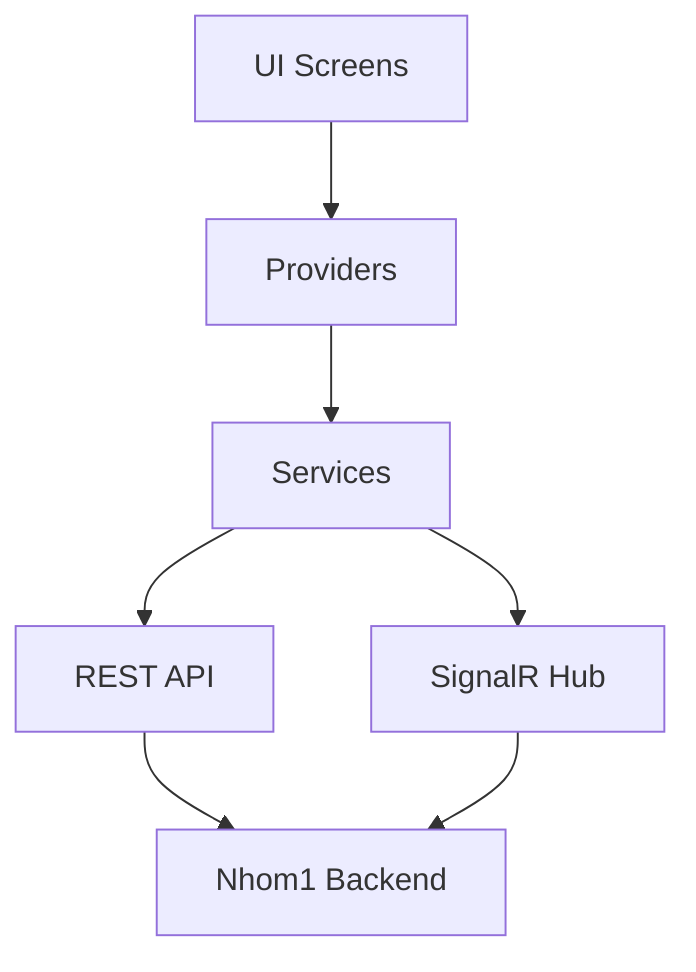
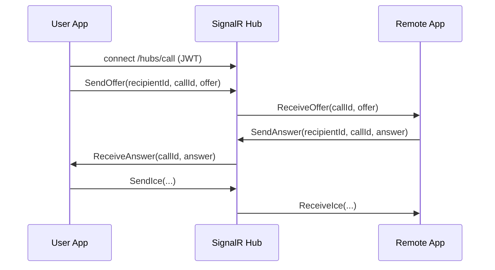

<div align="center">

# HOMESTAY APP (FLUTTER)

Ung dung mobile cho he thong Homestay: booking, payment, host management, chat/call realtime, AI support.

[](pubspec.yaml)
[](pubspec.yaml)
[](lib/providers)
[](lib/services/call_service.dart)

</div>

---

## Muc luc

1. [Gioi thieu](#gioi-thieu)
2. [Kha nang noi bat](#kha-nang-noi-bat)
3. [Kien truc app](#kien-truc-app)
4. [Cau truc thu muc](#cau-truc-thu-muc)
5. [Yeu cau he thong](#yeu-cau-he-thong)
6. [Cai dat](#cai-dat)
7. [Cau hinh bien moi truong](#cau-hinh-bien-moi-truong)
8. [Run app](#run-app)
9. [Realtime call flow](#realtime-call-flow)
10. [Main routes](#main-routes)
11. [Danh sach package quan trong](#danh-sach-package-quan-trong)
12. [Testing va quality](#testing-va-quality)
13. [Troubleshooting](#troubleshooting)
14. [Security notes](#security-notes)

---

## Gioi thieu

`homestay_app` la ung dung Flutter da nen tang cho he thong dat phong homestay.

App phuc vu 3 doi tuong:

- User: tim kiem, dat phong, thanh toan, danh gia.
- Host: quan ly homestay, booking, doanh thu.
- Admin: dashboard, users, bookings, moderation.

App ket noi backend chinh qua REST API (`Nhom1`) va su dung SignalR cho call/chat realtime.

---

## Kha nang noi bat

- Dang nhap/dang ky, social sign-in, OTP flow.
- Role-based navigation (User/Host/Admin).
- Homestay listing + filter/search + map.
- Booking full flow + payment callback.
- Favorites + comparison + notifications.
- Chat AI (Gemini) + chat user-to-user.
- Voice features (TTS/STT), translation, YouTube.
- Call audio/video qua SignalR + WebRTC.

---

## Kien truc app



Pattern duoc su dung:

- UI layer: `lib/screens`
- State layer: `lib/providers`
- Data/API layer: `lib/services`
- Domain models: `lib/models`
- Shared UI components: `lib/widgets`

---

## Cau truc thu muc

```text
lib/
|- config/          # app colors/theme/api config
|- models/          # data models
|- providers/       # state management
|- screens/         # feature screens
|- services/        # api/realtime/business services
|- utils/           # helper utils
|- widgets/         # reusable widgets
|- main.dart        # app bootstrap
`- routes.dart      # route table + dynamic routes
```

Mot so module screens lon:

- `screens/auth`
- `screens/home`
- `screens/booking`
- `screens/host`
- `screens/admin`
- `screens/chat`
- `screens/call`

---

## Yeu cau he thong

- Flutter SDK `>=3.0.0 <4.0.0`
- Dart SDK `>=3.0.0 <4.0.0`
- Android Studio/Xcode theo platform
- Backend API dang chay (`Nhom1`)

Kiem tra nhanh:

```bash
flutter --version
dart --version
flutter doctor
```

---

## Cai dat

```bash
flutter pub get
```

Neu can regenerate code (Hive/build runner):

```bash
dart run build_runner build --delete-conflicting-outputs
```

---

## Cau hinh bien moi truong

1. Tao file `.env` tu template:

```bash
copy .env.example .env
```

2. Cap nhat cac bien quan trong:

```env
API_BASE_URL=http://10.0.2.2:5189
GOOGLE_MAPS_API_KEY=YOUR_KEY
GEMINI_API_KEY=YOUR_KEY
```

Ghi chu:

- App load `.env` trong `main.dart`.
- API base URL duoc doc trong `lib/config/api_config.dart`.
- Neu emulator Android, dung `10.0.2.2` thay `localhost`.

---

## Run app

```bash
flutter run
```

Build release:

```bash
flutter build apk --release
```

---

## Realtime call flow



File chinh:

- `lib/services/call_service.dart`
- `lib/screens/call/call_screen.dart`

---

## Main routes

Routes dinh nghia trong `lib/routes.dart`:

- `/` splash
- `/login`, `/register`, `/forgot-password`
- `/main`
- `/host-dashboard`, `/manage-homestays`, `/host-bookings`
- `/admin`, `/admin/users`, `/admin/bookings`
- `/chat-list`, `/chat-detail`
- `/ai-chat`

Dynamic route:

- `/booking` voi arguments (homestayId, checkIn, checkOut, guests)

---

## Danh sach package quan trong

- State: `provider`, `get`
- Network: `http`, `dio`
- Realtime: `signalr_netcore`, `flutter_webrtc`
- Storage: `shared_preferences`, `hive`, `flutter_secure_storage`
- UI/UX: `cached_network_image`, `flutter_svg`, `lottie`, `fl_chart`
- Maps: `google_maps_flutter`, `geolocator`, `flutter_map`
- Voice/AI: `flutter_tts`, `speech_to_text`, `google_mlkit_translation`

Chi tiet xem `pubspec.yaml`.

---

## Testing va quality

Run unit/widget test:

```bash
flutter test
```

Static analyze:

```bash
flutter analyze
```

Format code:

```bash
dart format .
```

---

## Troubleshooting

### Khong goi duoc API

- Kiem tra `API_BASE_URL` trong `.env`.
- Kiem tra backend co dang chay dung port.
- Kiem tra CORS va JWT token.

### SignalR khong connect

- Dam bao endpoint backend dung `/hubs/call`.
- Kiem tra token trong `StorageService`.
- Kiem tra protocol http/https trung khop.

### Google login fail

- Kiem tra `GOOGLE_SERVER_CLIENT_ID`.
- Kiem tra SHA1/SHA256 va OAuth config tren Google Console.

---

## Security notes

- Khong commit file `.env` that.
- Khong hard-code API keys trong code.
- Rotate keys neu da tung push len remote.
- Tach config dev/staging/prod ro rang.

---

## Related projects

- Root architecture guide: `../README.md`
- Mobile API backend: `../Nhom1`
- Web/Admin backend: `../WebHS`


---

## 5. Hướng dẫn sử dụng
1. Đăng ký tài khoản và đăng nhập.
2. Tìm kiếm homestay phù hợp.
3. Thêm vào giỏ hàng hoặc đặt phòng trực tiếp.
4. Thanh toán và nhận xác nhận.
5. Đánh giá sau khi sử dụng dịch vụ.
6. Sử dụng các chức năng nâng cao như AI chat, bản đồ, video, v.v.

---

## 6. Liên hệ hỗ trợ
- Email: support@homestaybooking.vn
- Hotline: 1900-xxxxxx
- Fanpage: facebook.com/homestaybooking

---

# 7. Hướng dẫn luồng xử lý code các chức năng chính

## 7.1 Đăng ký/Đăng nhập
- **Frontend:**
  - Giao diện nhập thông tin (email, mật khẩu, xác thực OTP).
  - Gửi request qua API `/api/auth/login` hoặc `/api/auth/register`.
  - Nhận token, lưu vào local storage/shared preferences.
- **Backend:**
  - Controller nhận request, xác thực thông tin.
  - Nếu hợp lệ, sinh JWT token trả về frontend.
  - Lưu thông tin đăng nhập, cập nhật trạng thái user.

## 7.2 Phân quyền ROLE
- **Frontend:**
  - Sau khi đăng nhập, kiểm tra role từ token/user info.
  - Hiển thị menu, chức năng phù hợp (User, Host, Admin).
- **Backend:**
  - Middleware kiểm tra quyền truy cập API.
  - Chỉ cho phép truy cập các API phù hợp với từng role.

## 7.3 Đặt phòng Homestay
- **Frontend:**
  - Người dùng chọn homestay, ngày, số lượng phòng.
  - Gửi request đặt phòng qua API `/api/bookings`.
  - Hiển thị trạng thái đặt phòng, thông báo thành công/thất bại.
- **Backend:**
  - Controller nhận request, kiểm tra phòng trống.
  - Nếu hợp lệ, tạo booking, trừ phòng, gửi thông báo.
  - Lưu lịch sử đặt phòng vào database.

## 7.4 Đánh giá Homestay
- **Frontend:**
  - Sau khi hoàn thành chuyến đi, hiển thị form đánh giá.
  - Gửi đánh giá qua API `/api/reviews`.
- **Backend:**
  - Nhận và lưu đánh giá vào bảng reviews.
  - Tính điểm trung bình, cập nhật vào homestay.

## 7.5 Chat AI (Gemini)
- **Frontend:**
  - Giao diện chat, nhập câu hỏi.
  - Gửi message qua API `/api/ai/chat`.
  - Hiển thị phản hồi AI trả về.
- **Backend:**
  - Nhận message, gọi API Gemini hoặc AI nội bộ.
  - Xử lý, trả về câu trả lời phù hợp.
  - Lưu lịch sử chat vào database.

## 7.6 Quản lý CRUD (Homestay, User, Booking...)
- **Frontend:**
  - Giao diện danh sách, thêm, sửa, xóa.
  - Gửi request qua các API tương ứng (`/api/homestays`, `/api/users`, ...).
- **Backend:**
  - Controller nhận request, xác thực, thao tác với database.
  - Trả về kết quả (danh sách, chi tiết, trạng thái thành công/thất bại).

## 7.7 Tích hợp bản đồ, Youtube, API thời tiết
- **Frontend:**
  - Sử dụng Google Maps/Youtube API để hiển thị bản đồ, video.
  - Gọi API thời tiết, hiển thị thông tin tại homestay.
- **Backend:**
  - (Nếu cần) Proxy các request API, bảo vệ API key.

## 7.8 Xác thực sinh trắc học (Face ID/Vân tay)
- **Frontend:**
  - Sử dụng package Flutter hỗ trợ Face ID/Vân tay.
  - Khi đăng nhập/thanh toán, gọi hàm xác thực sinh trắc học.
- **Backend:**
  - Không xử lý, xác thực thực hiện trên thiết bị người dùng.

---

# 8. Ví dụ chi tiết: Cấu trúc file và vai trò từng file cho một chức năng

## 8.1 Chức năng: Đặt phòng Homestay

### 1. Frontend (Flutter)
- **lib/screens/booking/booking_screen.dart**
  - Giao diện chọn homestay, ngày, số lượng phòng, nhập thông tin đặt phòng.
  - Gọi hàm đặt phòng khi người dùng nhấn nút xác nhận.
- **lib/services/booking_service.dart**
  - Chứa các hàm gọi API backend (POST, GET booking).
  - Xử lý dữ liệu trả về, thông báo lỗi/thành công.
- **lib/models/booking.dart**
  - Định nghĩa model Booking (id, userId, homestayId, ngày, trạng thái...)
- **lib/providers/booking_provider.dart**
  - Quản lý trạng thái đặt phòng, danh sách booking của user.
  - Lắng nghe thay đổi và cập nhật UI khi có booking mới.

### 2. Backend (.NET)
- **Controllers/BookingsController.cs**
  - Nhận request đặt phòng từ frontend (POST /api/bookings).
  - Kiểm tra phòng trống, xác thực user, tạo booking mới.
  - Trả về kết quả (thành công/thất bại, chi tiết booking).
- **Models/Booking.cs**
  - Định nghĩa entity Booking, ánh xạ với bảng Booking trong database.
- **Services/BookingService.cs**
  - Chứa logic kiểm tra phòng trống, tạo booking, gửi thông báo.
- **Data/ApplicationDbContext.cs**
  - Quản lý truy vấn, lưu booking vào database.
- **Migrations/**
  - Chứa các file migration tạo bảng Booking trong database.

### 3. Luồng hoạt động tổng quát
1. Người dùng thao tác trên `booking_screen.dart` → nhập thông tin đặt phòng.
2. Gọi hàm trong `booking_service.dart` để gửi request tới API.
3. API `/api/bookings` được xử lý bởi `BookingsController.cs`.
4. Controller gọi `BookingService.cs` để kiểm tra logic và lưu vào DB qua `ApplicationDbContext.cs`.
5. Kết quả trả về frontend, cập nhật trạng thái qua `booking_provider.dart` và hiển thị trên UI.

---

> Bạn có thể áp dụng cấu trúc này cho các chức năng khác như đánh giá, chat, quản lý user... bằng cách thay đổi tên file và logic tương ứng.
